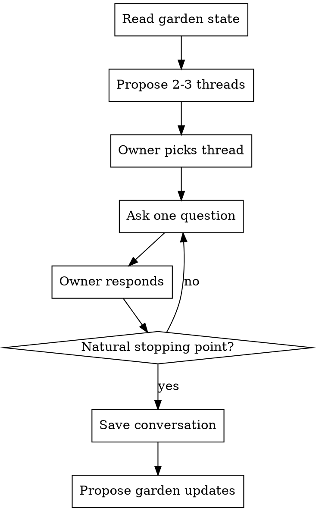

# Reflect

Socratic dialogue for periodic review. Helps the owner articulate what they actually think — positions, tensions, open questions — by asking probing questions against the garden's existing sources and ideas.

## When to Use

Use when the user says `/reflect`, "let's think about...", "I want to dig into...", or asks to review existing material in the garden.

## Flow



## Step 1: Read the Garden

Before proposing threads, scan:
- `maps/` — thematic structure, owner's priorities
- `ideas/` — concept handles, which ones lack personal positions
- `sources/*/summary.md` — key ideas, tiers, connections
- `conversations/` — past dialogues, open questions left unresolved

## Step 2: Propose Threads

Suggest 2-3 threads worth pulling on. Prioritize:

1. **Tensions** — two high-tier sources that disagree on something
2. **Under-explored** — ideas linked to many sources but never discussed in a conversation
3. **Open questions** — unresolved questions from previous `/reflect` sessions
4. **Cross-domain** — connections that span different intellectual domains
5. **High-tier, low-position** — perennial/evergreen sources where the summary mostly restates the author with no personal take

The owner can also bring their own topic. That's fine — skip to step 3.

## Step 3: Socratic Dialogue

Ask one question at a time. Wait for the answer. Build on what the owner says.

### Question types

- **Position-seeking:** "What do you actually believe about X?"
- **Prioritizing:** "Is X more important to you than Y? Why?"
- **Tension-finding:** "You value both A and B, but they disagree on Z. Which wins?"
- **Grounding:** "Why does this matter to you? What situation makes this relevant?"
- **Challenging:** "What would change your mind?"
- **Synthesizing:** "If you had to explain this in 30 seconds, what would you say?"
- **Connecting:** "This sounds a lot like [idea from a different domain]. Is that the same insight or a different one?"

### Conversation style

- Direct, concise questions. No preamble.
- One question per turn.
- Build on the owner's answers — don't cycle through a pre-made list.
- Push back on vague answers. "Can you be more specific?" is a valid question.
- Notice contradictions — with things said earlier, with past conversations, with source summaries.
- 5-10 exchanges is a good length. Read the energy — don't drag it out.

### What NOT to do

- Do NOT summarize books back at the owner. They already did that.
- Do NOT give "right answers" or lecture.
- Do NOT validate. No "great point!" — push, don't praise.
- Do NOT ask recall questions. That's what flashcards are for.

## Step 4: Save the Conversation

When the dialogue reaches a natural stopping point, save to `conversations/YYYY-MM-DD-on-{topic}.md`.

### File format

```markdown
---
title: "On planning vs. antifragility"
date: 2026-02-16
sources:
  - the-goal
  - the-7-habits-of-highly-effective-people
ideas:
  - antifragility
  - theory-of-constraints
---

## Thread

One-line description of the thread that was explored.

## Dialogue

**Q:** First question...

**A:** Owner's response...

**Q:** Follow-up...

**A:** ...

## Positions

- Position that emerged from the dialogue.
- Another position.

## Open questions

- Things left unresolved for future sessions.
```

The **Positions** section distills what the owner said into clear stances. The **Open questions** section captures threads worth returning to.

## Step 5: Propose Garden Updates

After saving, propose (but do NOT apply) updates to other garden files:

- New ideas that crystallized during the conversation
- Positions to add to existing idea files
- New connections between sources
- Tier changes if the conversation revealed a source is more/less important than currently rated

Present each proposal as a checklist. The owner approves or dismisses each one.

```markdown
## Proposed garden updates

- [ ] Add position to `ideas/antifragility.md`: "Planning direction is antifragile; planning tactics is fragile"
- [ ] New idea: `ideas/directional-planning.md`
- [ ] Add connection: `the-goal` <-> `the-7-habits` on constraint-based prioritization
```

## Naming Conventions

- Conversation files: `YYYY-MM-DD-on-{topic-slug}.md`
- Topic slugs use kebab-case: `on-planning`, `on-meaning-and-suffering`
- If multiple conversations happen on the same day and topic, append a number: `2026-02-16-on-planning-2.md`
